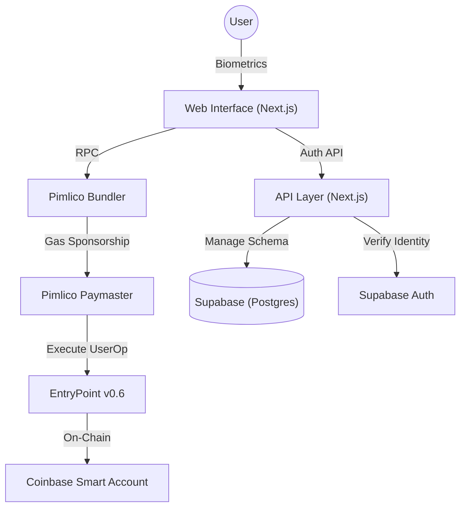
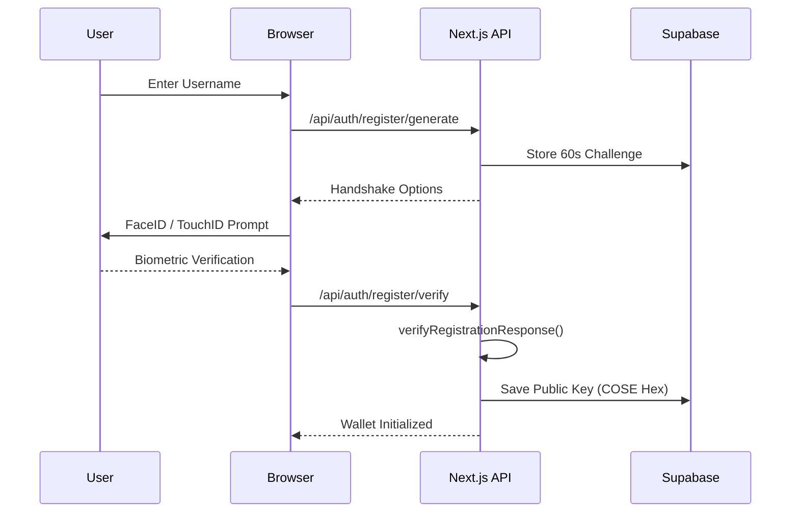
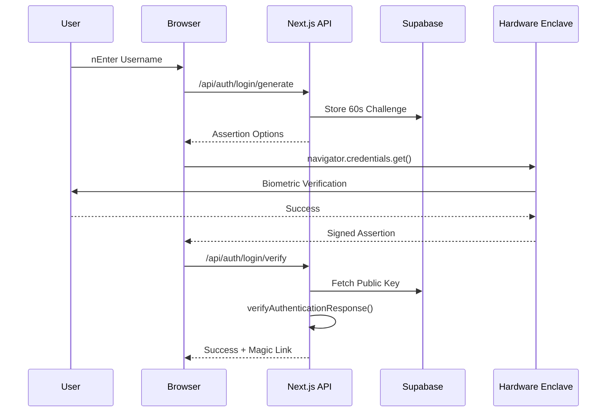
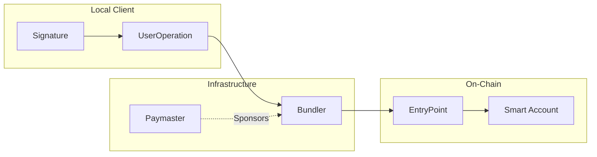

# 🛡️ BioVault: Biometric-Native Smart Wallet

BioVault is a next-generation Web3 authentication platform that turns your hardware biometric enclave (FaceID, TouchID, Windows Hello) into your private key. No seed phrases. No passwords. Just you.

## 🏗️ System Architecture



## 🚀 Key Features

- **Passkey Authentication:** FIDO2/WebAuthn standard integration for secure, seedless login.
- **ERC-4337 Smart Accounts:** Automatically generates a Coinbase Smart Wallet for every user.
- **Gasless Transactions:** Sponsored by Pimlico Paymaster on Polygon Amoy.
- **Supabase Vault:** Securely stores passkey metadata using Row Level Security (RLS).

---

## 🔐 How it Works (WebAuthn Flow)

BioVault uses a **Challenge-Response** mechanism to ensure non-custodial security. Your private key never leaves the hardware enclave.

### Registration Flow


### Authentication Flow (Login)


---

## 🛠️ Mandatory Setup (Supabase)

For BioVault to function, you **MUST** execute the following SQL in your Supabase SQL Editor. This enables the secure storage and retrieval of passkeys.

```sql
-- 1. Create the passkeys table
CREATE TABLE IF NOT EXISTS public.passkeys (
    id TEXT PRIMARY KEY, 
    user_id UUID NOT NULL REFERENCES auth.users(id) ON DELETE CASCADE,
    public_key TEXT NOT NULL, 
    counter BIGINT NOT NULL DEFAULT 0,
    device_type TEXT DEFAULT 'single_device',
    transports TEXT[] DEFAULT '{}',
    created_at TIMESTAMPTZ DEFAULT NOW(),
    last_used_at TIMESTAMPTZ DEFAULT NOW()
);

-- 2. Create the profiles table
CREATE TABLE IF NOT EXISTS public.profiles (
    id UUID PRIMARY KEY REFERENCES auth.users(id) ON DELETE CASCADE,
    username TEXT UNIQUE NOT NULL,
    display_name TEXT,
    wallet_address TEXT,
    updated_at TIMESTAMPTZ DEFAULT NOW()
);

-- 3. Create the challenges table (Handshake Logic)
CREATE TABLE IF NOT EXISTS public.challenges (
    id UUID PRIMARY KEY DEFAULT gen_random_uuid(),
    challenge TEXT UNIQUE NOT NULL,
    type TEXT NOT NULL, -- 'registration' or 'authentication'
    expires_at TIMESTAMPTZ NOT NULL,
    created_at TIMESTAMPTZ DEFAULT NOW()
);

-- 4. Enable Security (RLS)
ALTER TABLE public.passkeys ENABLE ROW LEVEL SECURITY;
ALTER TABLE public.profiles ENABLE ROW LEVEL SECURITY;
ALTER TABLE public.challenges ENABLE ROW LEVEL SECURITY; -- Optional for service role

-- 5. Create Policies
CREATE POLICY "Users can view their own passkeys" ON public.passkeys FOR SELECT USING (auth.uid() = user_id);
CREATE POLICY "Users can view their own profile" ON public.profiles FOR SELECT USING (auth.uid() = id);
```

---

## ⚡ Getting Started

1. **Environment Variables:**
   Create a `.env.local` with the following:
   ```env
   NEXT_PUBLIC_SUPABASE_URL=your_project_url
   NEXT_PUBLIC_SUPABASE_ANON_KEY=your_anon_key
   SUPABASE_SERVICE_ROLE_KEY=your_service_role_key
   NEXT_PUBLIC_BUNDLER_RPC_URL=your_pimlico_rpc_url
   ```

2. **Install Dependencies:**
   ```bash
   npm install
   ```

3. **Run Locally:**
   ```bash
   npm run dev
   ```

---

## 🔍 Troubleshooting

### "Passkey Not Found" in Dashboard
If you see "Passkey Not Found" on the dashboard:
1. **RLS Issue:** Ensure you have run the SQL commands above to enable `ROW LEVEL SECURITY` and created the `SELECT` policy.
2. **Missing Record:** You may have registered before the database schema was finalized. Clear your site data, re-register, and log in again.

### "Probable Cloned Authenticator"
This occurs if the hardware counter is reset. BioVault is configured to allow `0` counter values for single-device authenticators (FaceID/Windows Hello). If you encounter this, ensure you are using the latest code which ignores zero-value counter regression.

---

## 📜 Technology Stack

- **Framework:** Next.js 15 (App Router)
- **Database:** Supabase (Auth + Postgres)
- **Web3:** Viem + Permissionless.js
- **AA Infrastructure:** Pimlico (Bundler + Paymaster)
- **Identity:** FIDO2 WebAuthn (SimpleWebAuthn)
- **Design:** Tailwind CSS + Framer Motion

---

## ⛓️ Blockchain Execution (ERC-4337)

BioVault uses a **Deterministic Address Derivation** strategy based on the WebAuthn Public Key.



1. **UserOperation**: Every interaction is a "UserOp" signed by the P256 key in your hardware.
2. **Bundlers**: Pimlico picks up the UserOp and bundles it into a standard Ethereum transaction.
3. **Paymasters**: Sponsors the gas cost (MATIC), allowing users to use the vault with zero balance for management.
4. **Counterfactual Deployment**: Wallets are only deployed to the blockchain when the *first* transaction is sent, saving on unnecessary initialization costs.
