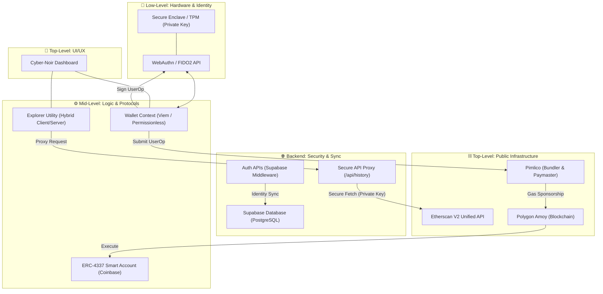

# 🛡️ BioVault: Elite Biometric-Native Smart Wallet

BioVault is a production-grade Web3 authentication platform and smart wallet that leverages hardware-bound biometrics (FaceID, TouchID, Windows Hello) to create a seamless, seedless, and non-custodial blockchain experience.

## 🎯 Architecture Diagram

Below is the high-level system architecture of BioVault, from the low-level hardware enclave to the top-level user interface.



## 💻 Tech Stack (2026 Standard)

- **Frontend**: Next.js 15 (App Router), React 19, Tailwind CSS, Framer Motion.
- **Logic & AA**: [Permissionless.js](https://docs.pimlico.io/permissionless), [Viem](https://viem.sh), [SimpleWebAuthn](https://simplewebauthn.dev).
- **Core Infrastructure**: [Pimlico](https://pimlico.io) (Bundler & Paymaster / ERC-4337 v0.6).
- **Backend / Database**: [Supabase](https://supabase.com) (PostgreSQL + RLS + Auth).
- **Explorer API**: Etherscan V2 Unified (Unified protocol for Polygon Amoy).
- **Blockchain**: Polygon Amoy (Testnet).

---

## 📁 Project Structure

```bash
/src
  ├── /app            # Next.js App Router (Routes, APIs, Layouts)
  ├── /components     # UI Components (Dashboard, Auth, UI primitives)
  ├── /config         # Centralized & Zod-validated environment config
  ├── /context        # Global React state (Wallet, Auth providers)
  ├── /lib            # Core implementation logic (Smart Wallet, WebAuthn)
  ├── /types          # 🧠 Centralized domain-level type definitions (Zod)
  └── /_deprecated    # 🛡️ Legacy/archived code (Recoverable)
/docs
  └── /_deprecated    # 🛡️ Legacy documentation and root artifacts
```

---

## ✨ Key Features

- 🔑 **Passkey Authentication**: FIDO2 compliant registration and login.
- 💳 **Smart Wallet**: Deterministic ERC-4337 smart account derivation.
- ⛽ **Gasless Experience**: Sponsored transactions via Pimlico Paymaster.
- 📊 **Metric Dashboard**: Real-time balance tracking and transaction history.
- 🛡️ **Secure Explorer Proxy**: Private Etherscan API key hidden via internal API.
- 🖤 **Cyber-Noir UI**: High-fidelity, monochromatic, responsive design.

---

## ⚙️ Setup Instructions

### 1. Clone the Repository
```bash
git clone https://github.com/Luckyhunt/Bio_Vault.git
cd Bio_Vault
```

### 2. Install Dependencies
```bash
npm install
```

### 3. Configure Environment Variables
Create a `.env.local` file in the root directory:

```env
# --- Supabase (Sync & Persistence) ---
NEXT_PUBLIC_SUPABASE_URL=https://your-project.supabase.co
NEXT_PUBLIC_SUPABASE_ANON_KEY=your-public-anon-key
SUPABASE_SERVICE_ROLE_KEY=your-secret-service-role-key

# --- Network & RP (Identity) ---
NEXT_PUBLIC_RPC_URL=https://rpc-amoy.polygon.technology
NEXT_PUBLIC_RP_ID=localhost
NEXT_PUBLIC_ORIGIN=http://localhost:3000
NEXT_PUBLIC_RP_NAME=BioVault

# --- Account Abstraction (Pimlico / ERC-4337) ---
NEXT_PUBLIC_PIMLICO_URL=https://api.pimlico.io
NEXT_PUBLIC_BUNDLER_RPC_URL=https://api.pimlico.io/v2/80002/rpc?apikey=your-api-key
NEXT_PUBLIC_ENTRYPOINT=0x5FF137D4b0FDCD49DcA30c7CF57E578a026d2789

# --- Unified Explorer (Etherscan V2 Proxy) ---
ETHERSCAN_API_KEY=your-private-etherscan-key
NEXT_PUBLIC_EXPLORER_API_URL=https://api.etherscan.io/v2/api
NEXT_PUBLIC_CHAIN_ID=80002
NEXT_PUBLIC_EXPLORER_TX_URL=https://amoy.polygonscan.com/tx/
```

---

## 🔐 Security Architecture

- **Hardware-Enforced Privacy**: Private keys are non-exportable and bound to your device (TPM/Secure Enclave). Only public keys (COSE/PKCS) are stored in Supabase.
- **Secure Explorer Proxy**: To keep your protocol keys private, the frontend never calls Etherscan directly. Instead, it communicates with `/api/history`, which uses the private `ETHERSCAN_API_KEY` on the server.
- **Zod-Validated Config Layer**: The application uses a strict validation layer (`src/config/env.ts`) to ensure all critical variables are present before any code execution occurs.
- **Deterministic Counterfactual Deployment**: Smart wallets are derived deterministically from biometrics and deployed on the blockchain only during the first transaction.

---

## 🧪 Testing

### Authentication
- Register a new unique username with biometric registration.
- Perform a "Handshake" to initialize the account state.
- Log out and log back in effortlessly using only biometrics.

### Transactions
- View MATIC balance and smart account address.
- Send a test transaction (first tx triggers deployment).
- Verify the transaction hash on the Polygon Amoy explorer (linked via Dashboard).

---

## 📦 Deployment

1. **Vercel**: Connect your repository and define all variables in the Vercel Dashboard.
2. **Environment Variables**: Ensure `ETHERSCAN_API_KEY` and `SUPABASE_SERVICE_ROLE_KEY` are kept secret (no `NEXT_PUBLIC_` prefix).
3. **RP_ID & ORIGIN**: Update these to match your final production domain.

---

*Built with ❤️ by the BioVault Team*
